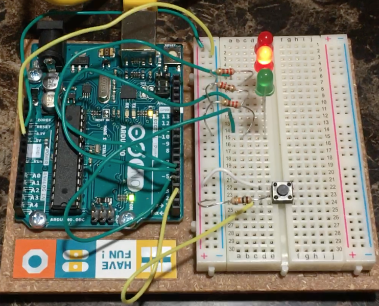

# Spaceship Interface

This project involved using digital input and output to create an LED spaceship interface! Using jumper wires, LEDs, switches, and resistors (220 Ω and 10 KΩ), I was able to have two red LEDs toggle and upon reading a digital input from a switch, have a green LED turn on. The circuit diagram for the project is as follows (from the Arduino Projects book):

When the switch is not pressed (giving a LOW state), the 2 Red LEDs alternate between HIGH and LOW with delays in the middle to make the toggling viewable to the user. When the switch is pressed, the Green LEDs light up and the Red LEDs stop toggling. A picture of the project is shown below:

