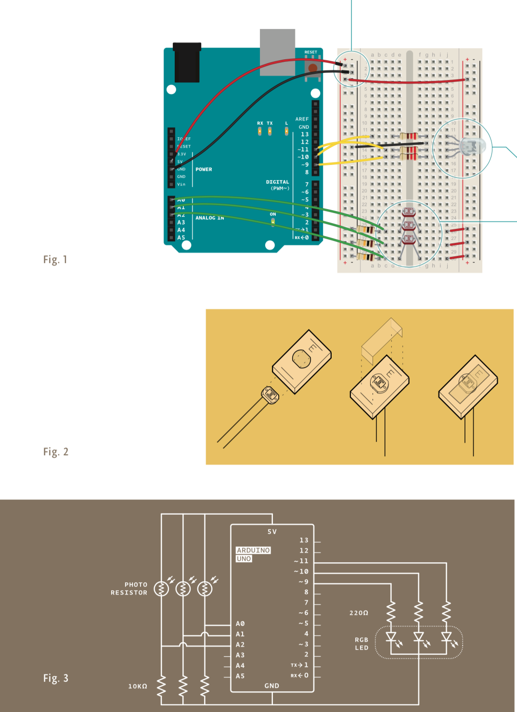
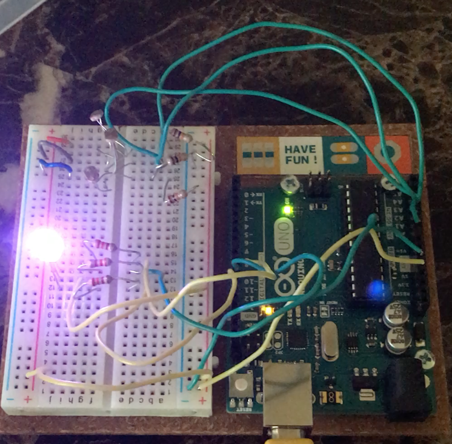

# Color Mixing Lamp

This project involved using analog output and mapping values to change the light color of a tri-color LED. Based on lighting conditions recorded by three photoresistors, mapped to the red, green, and blue values of the LED respectively, the tri-color LED changes color. Because the Arduino cannot vary the output voltage, using Pulse Width Modulation (PWD), the Arduino rapidly toggles the RGB values of the LED to mimic the effect of a color mix. The circuit diagram for the project is as follows (from the Arduino Projects book):

The color mixing lamp works by recording the value of each photoresistor (corresponding to red, green, and blue light), mapping the initial values (with range 0-1024) to a range of 0-256, and using PWD to mimic an analog write to the RGB LED values. This way, each value of RGB is toggled HIGH and LOW rapidly to mimic the analog RGB value, creating a color mixing effect.

Watch the Color Mixing Lamp demo [here](https://youtu.be/RogkvaJhrrY)!
