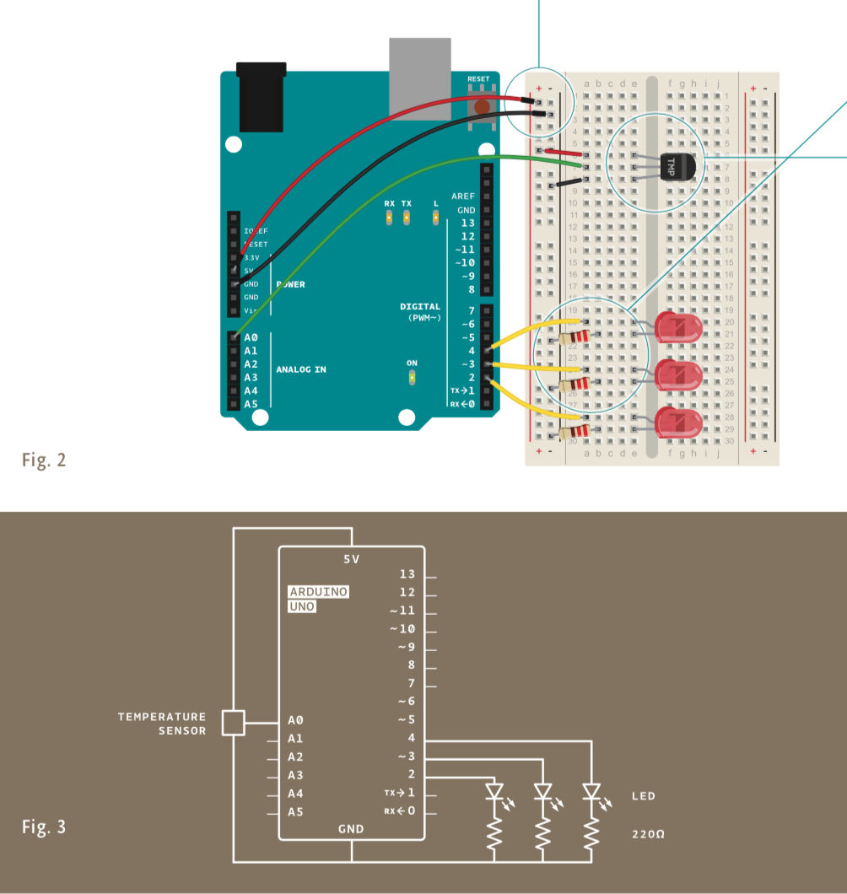
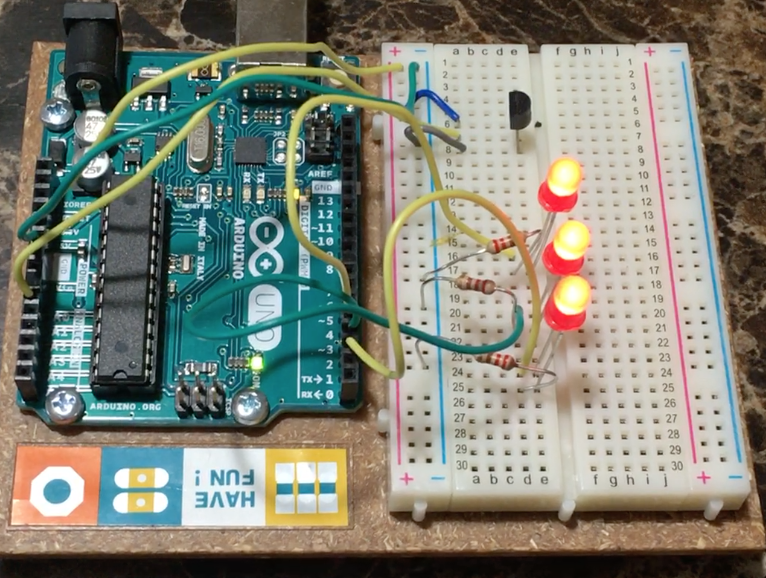

# Love-O-Meter

This project involved using analog input and digital output to create a "Love-O-Meter" that detects how "in love" (or warm) a person is! Using jumper wires, LEDs, a temperature sensor, and resistors (220 Ω), I was able to have three red LEDs light up based on the temperature detected by the temperature sensor. The circuit diagram for the project is as follows (from the Arduino Projects book):

Initially, the temperature sensor detects the base temperature and all LEDs are toggled off (LOW). Once the temperature begins to rise (after receiving an input to the temperature sensor), the LEDs light up (HIGH) one by one until a threshold is reached, by when all LEDs light up. Once the input to the sensor is removed, the LEDs slowly toggle off (LOW) one by one. The temperature sensor reports a value between 0-1023 which is then mapped to a voltage (between 0 and 5 V in this case) and converted to a temperature value in Celsius.

Watch the Love-O-Meter demo [here](https://youtu.be/lWSmHpT5iMw)!

## Miscellaneous Notes
Note to Self: Make sure you check the polarity of the sensors via the debug statements. Unfortunately, when I first tried this, it resulted in a minor burn.
