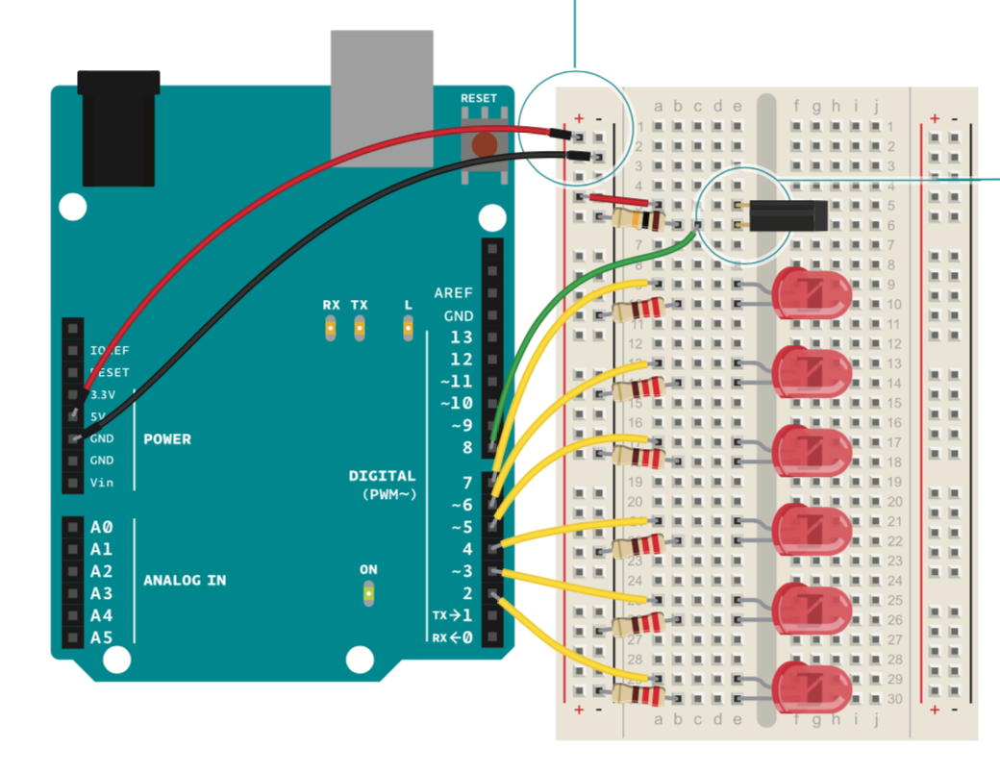
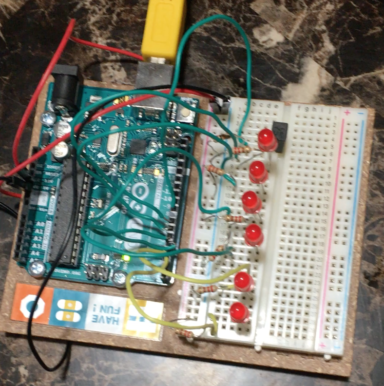

# Digital Hourglass

This project involved using the Arduino's built-in timer to build a "digital hourglass" that turns on an LED every 2 seconds. By comparing the current recorded time and the previous recorded time, the program is able to compute how much time has elapsed without halting the execution by using a delay(). When all LEDs have been turned on, the timer can be reset with a tilt switch. The circuit diagram for the project is as follows (from the Arduino Projects book):

The hourglass works by using the millis() function which returns the current recorded time since the program was uploaded to the Arduino. By storing the initial time and comparing the current time of execution, the hourglass determines if the time difference has exceeded a user-set interval (which in this case is 2 seconds). If the time difference exceeds the interval, the next LED is turned on and the process starts over. If at any point the tilt switch is pressed, the hourglass resets by turning off all of the LEDs and restarting the timer. Hence, this acts as a digital hourglass as the user is able to see how much time remains based on the number of LEDs that are turned on.

Watch the Digital Hourglass demo [here](https://youtu.be/Da68Yf8bPzU)!
