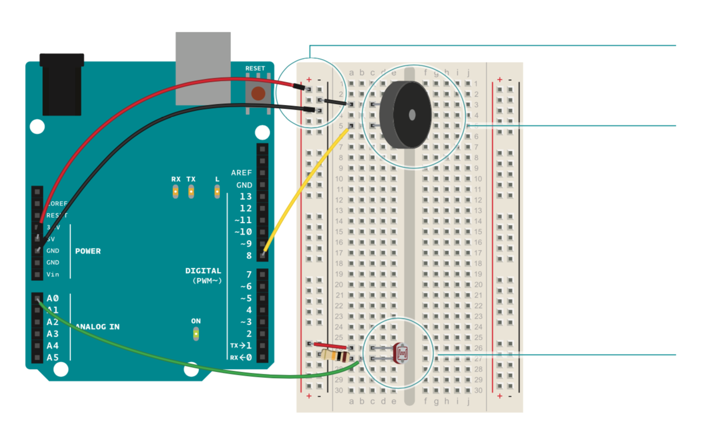
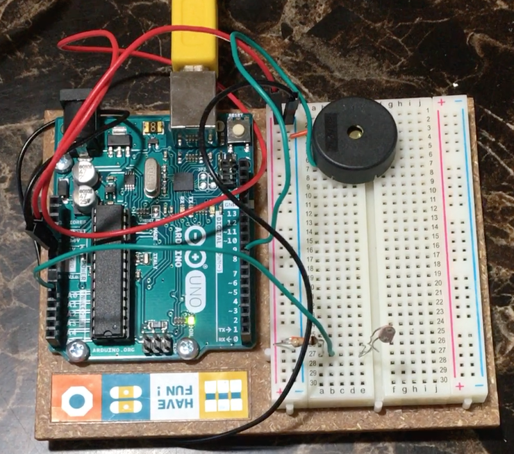

# Light Theremin

This project involved using analog input from a photoresistor to control the pitch of a Piezo element. This creates a light-based theremin, which is an instrument that makes sound based on a musician's hands around the instrument. The circuit diagram for the project is as follows (from the Arduino Projects book):

Initially, there's a calibration phase (of ~7 seconds), where the photoresistor is exposed to the maximum and minimum light levels. Once the calibration phase is complete, the pitch of the piezo is controlled with the sensor values of the photoresistor which is mapped to the different frequencies of the piezo. This creates the effect of a theremin where the sound pitch of the piezo is controlled by the light levels affecting the photoresistor!

Watch the Light Theremin demo [here](https://youtu.be/gijv9Q55Pxs)!
