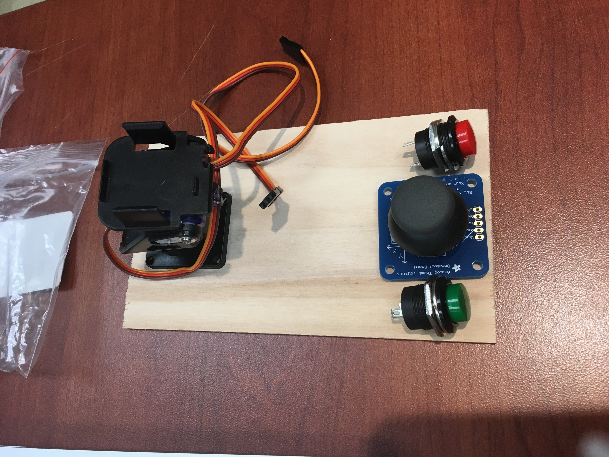
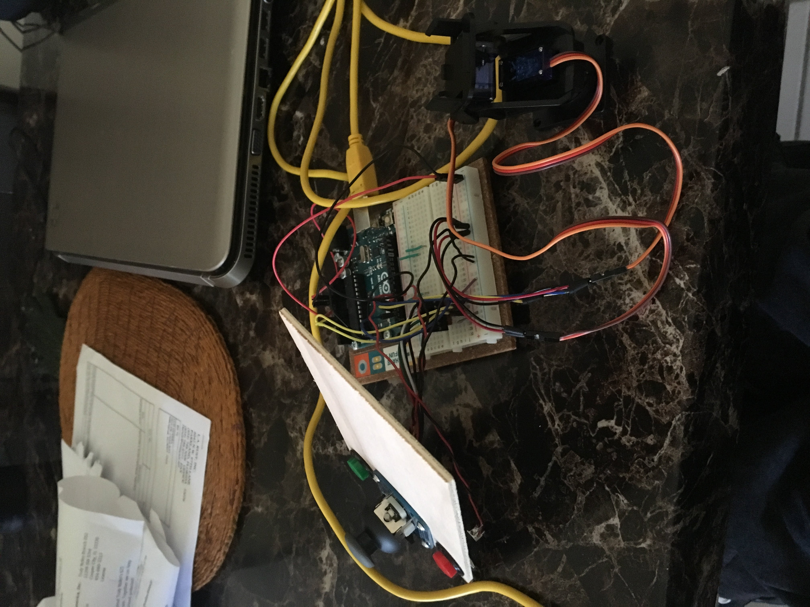
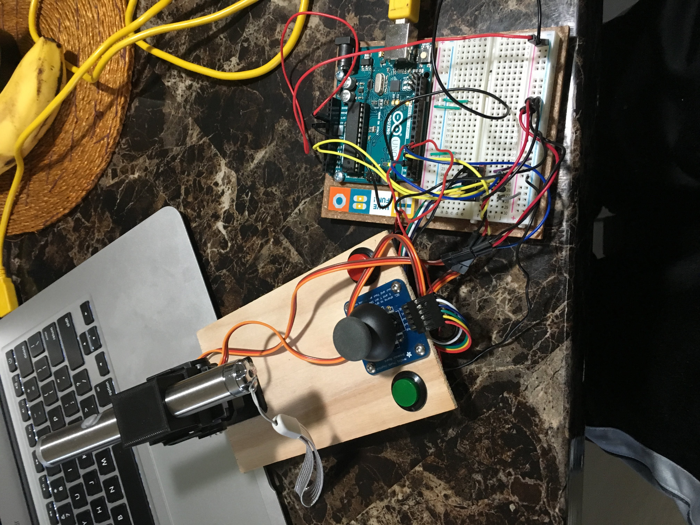
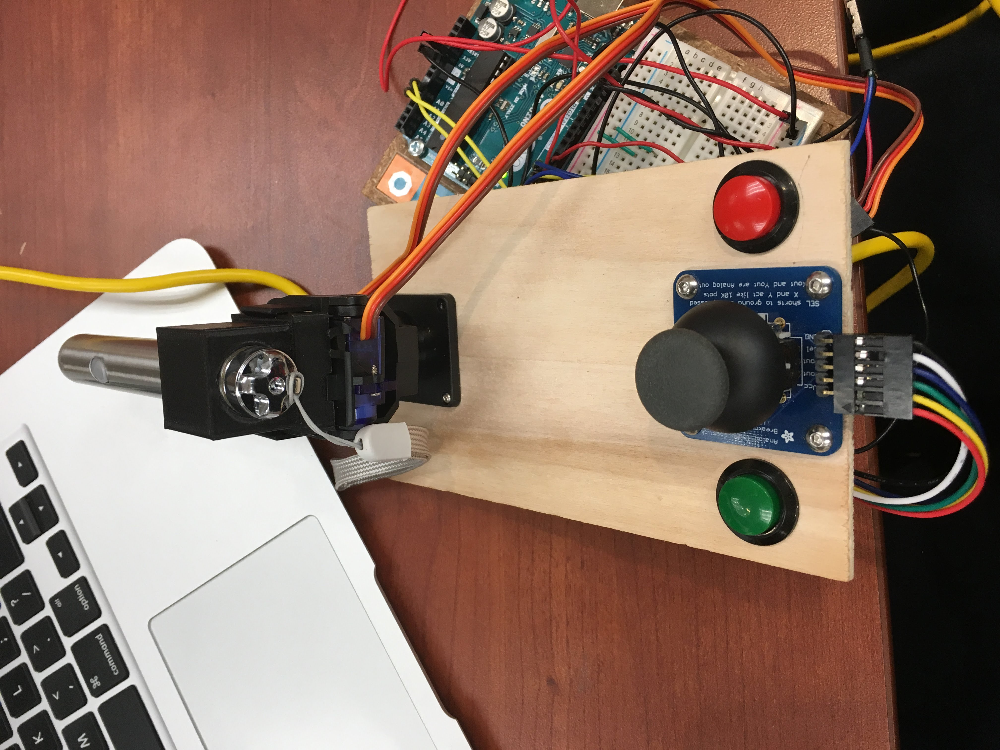
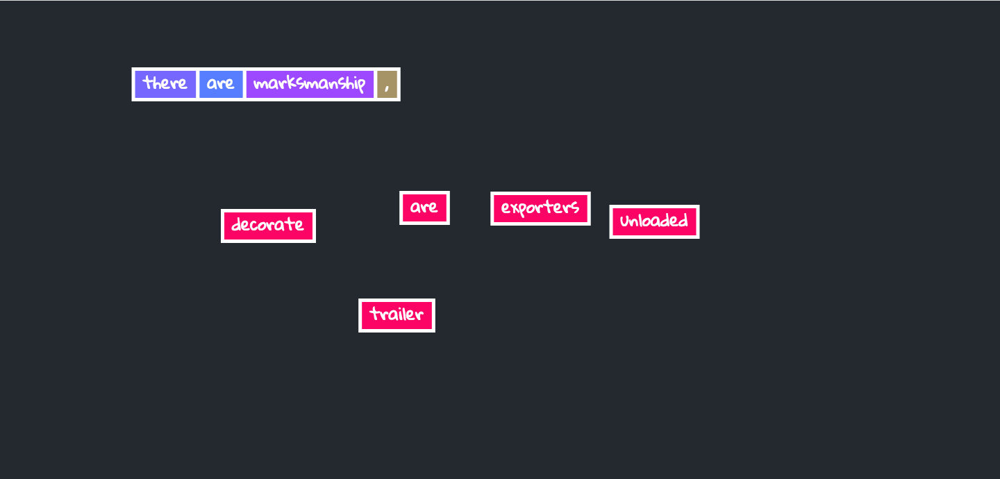
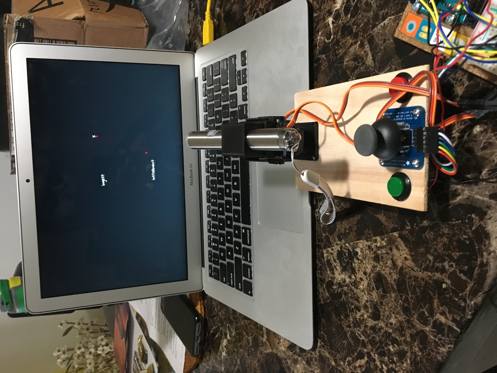

# Word Jam

This was a collaborative project with @jerrybonnell. My role in Word Jam was to create the Arduino controller, integrate it with the Word Jam's front end, and implement sound functionality. This folder will include details about the Arduino controller and how it's used with Word Jam's front end. See the source code and setup instructions [here](https://github.com/gururaj-shriram/WordJam)!

## Why This Project?
I wanted to create a fun project that combines the physical and digital world. Often times, we are limited to exploring only one of the two worlds; this project aims to combine the best of both worlds! Word Jam is a game, wherein the player controls a movable laser pointer with a joystick with the option of pressing buttons to add or remove words. Words are chosen at random, and it is up to the player to add/delete/reposition words to try to create a story! Another reason I chose to make this project is because it uses a laser -- no explanation is required. :laughing:

## Parts
* Arduino Uno
* Mini Pan-Tilt Kit - Assembled with Micro Servos
* Analog 2-axis Thumb Joystick with Select Button + Breakout Board
* 2 16mm Panel Mount Momentary Pushbutton (1 Green and 1 Red)
* Laser pointer
* 3D printed laser pointer clamp
* Camera tripod
* Jumper wires
* Soldering equipment
* Wood (for the base of the controller)
* Cutting equipment

### 3D Printed Laser Pointer Clamp
To attach the laser pointer to the pan-tilt device, I 3D Printed a clamp. It is essentially a box that has a hole to fit the laser pointer and a base that fits on top of the pan-tilt device. The dimensions of the hole and base were a bit too tight, so cutting tools were used to make more space. 

## Input
The input to Word Jam is the input from the Arduino controller. The Arduino controller is comprised of the pan-tilt device with a laser pointer clamped on top, a joystick, and two pushbuttons (1 green add button and 1 red remove button). When the user moves the joystick, the movement is mapped to the movement of the pan-tilt device which thusly moves the position of the laser and the cursor on the front end. When the user presses either the joystick select button (used to grab and move a word), add button (to add a random word), or red button (to remove a grabbed word), the signal is recorded. During every cycle of the Arduino's program, the positions of the laser (via the positions of the two servos on the pan-tilt device) and states of the joystick select button, add button, and remove button are sent to Word Jam's front end which is a `p5js` canvas. The aforementioned pieces of data are sent as a space separated string to the front end using by using the Arduino's serial output. 

For instance, the Arduino's output, which is also the input to Word Jam's front end, may look like this:

`panValue tiltValue addButtonState removeButtonState joystickButtonState`

The pan-tilt device was used because it is a simple, pre-built device that can move in all four cardinal directions which is ideal for a controller. Further, the top of the device allows items to be clamped, making it easier to attach the laser using the 3D printed clamp. The joystick and buttons were used not only because they give a "gamey, retro, arcade" feeling but also because they are simple to use for the user, and the controls to play the game are more intuitive in terms of the human-computer interactions. 

### The Controller -- In Progress

### The Final Controller

## Output
Word Jam's output is also its front end. Once the signals are sent from the Arduino controller, the `p5js` sketch parses the input. Accordingly, the positions to the cursor is updated based on the positions of the laser after performing some operations to translate the input to the cursor's position. When the sketch receives an "on" state for one of the buttons, the corresponding function is called to either generate a random word, move a word, or remove a grabbed word. The `p5js` canvas was used as a front end output because it can run on the browser, and it is easy to use and simple to portray the "digital world."

### Word Jam's Front End Example

### Testing The Output

## The Code
### Getting Controller Readings
`Word_Jam.ino` is the program which runs the controller. The Arduino uses its pins to read analog input from the joystick's X and Y positions and digital input from the pan, tilt, joystick select button, add button, and delete button. 

#### Moving the Laser
To move the laser, analog input is received from the pins attached to the joystick's x and y positions. Using this value, which ranges from 0 to 1023, an offset value is calculated between -5 and 5 using the map function. This offset is used to move the laser slightly in the cardinal directions based on its current position and sensitivity of the joystick movements. The offset is added to the previous pan and tilt values of the pan-tilt device, where the pan value is offsetted by the joystick's x value and the tilt value is offsetted by the joystick's y value. Once the new values for the pan and tilt values are calculated, their respective servos move to the new position, thus moving the laser. This value is also printed via the serial output (for the `p5js` sketch).

Because the joystick is rotated 90 degrees counterclockwise on the controller and the pan-tilt device is backwards to allow the laser to move up higher, the values sent to the `p5js` sketch are inverted; this means that if the value is `servoVal` the value being sent to the sketch is `maxServoVal - servoVal`. 

#### Button Smashing
Whenever a button, in this case the add button, remove button, or joystick select button, is pressed, the state of the button is recorded by performing a digital read. If the state differs from the previous state and the state is "on" (i.e. the button is pressed), a `1` is sent as serial output to indicate that the respective function should be called. If the state is "off" for any reason, a `0` is sent as serial output to indicate that nothing should be done for that function. `INPUT_PULLUP` is used for the buttons because it is recommended to use it for the joystick select button and because a resistor is no longer needed since `INPUT_PULLUP` automatically adjusts the resistance by flowing current and waiting for the current flow to cease rather than the other way around. 

### The Front End
`sketch.js` includes the main code that is used for the `p5js` front end. The `p5 Serial` library is used to receive serial output from the Arduino. Once the `SerialPort` object is opened, a series of callbacks trigger when serial events occur; the most important callback is the data callback. Whenever data is received from the Arduino, it is parsed and split into an array because the input includes space separated values. 

#### Calibration
To map the pan-tilt values with the values used in the `p5js` sketch, a calibration is required. Before beginning to play Word Jam, the laser should be moved to the top left and bottom right corners of the sketch, while pressing the `s` and `e` keys respectively after arriving at the necessary location. This is done to record the minimum and maximum pan and tilt values (or X and Y values for the sketch). These values are used to map pan and tilt values to X and Y positions on the canvas.

#### Using The Data
Once calibration is performed, the data can be used. The pan and tilt values are mapped to X and Y values on the `p5js` canvas, and the cursor (which is just a visual 'X') is updated accordingly. If a `1` is received for the add button, remove button, and/or joystick select button, the corresponding function is called; if a `0` is received, nothing happens. 

## The Final Product

## Project Retrospective
### What Worked
Ultimately, the entire end-to-end pipeline of using joystick controls for laser movements and finally using data for the front end canvas worked well overall. The controller is able to be used to play WordJam as a physical extension to a digital game.

### What Didn't Work
Because both the `p5 Serial` and `p5 Sound` libraries were used in the front end, the former would not allow running the sketch on a local server as it is using deprecated protocols and the latter requires running the local server to avoid browser security concerns of loading assets from a relative file path. Due to these conflicting limitations of the two libraries, the "solution" to use both these libraries is to run the local server and open the sketch using a relative path on a browser that does not have the aforementioned security concerns, such as `Mozilla Firefox`. A more in depth explanation of this is in the source code repository. 

Further, the laser movements are extremely sensitive, making it nontrivial to move it to the desired position. This is partially due to the fact that the resting value of the joystick is not always at the `(0, 0)` position and sometimes disperses in the `+- 1` range. Although experimentation was done to make it simpler, such as changing the servos from `write()` to `writeMicroseconds()`, it is still not as easy to use as was intended. Future testing may be needed to improve this. 

### if more_time:
If I had more time, I would try to experiment and try to make the laser movements more intuitive. I would also try to use other forms of controllers, such as gesture controls, image processing, or voice processing to try to create an even better controller for the human-computer interaction. It'd be incredible if the controller is "intelligent" enough to recognize the user's actions easily and efficiently.
