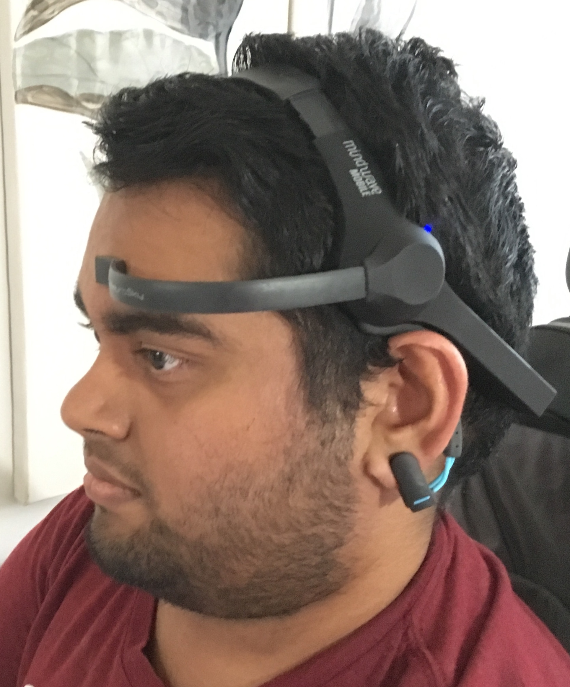
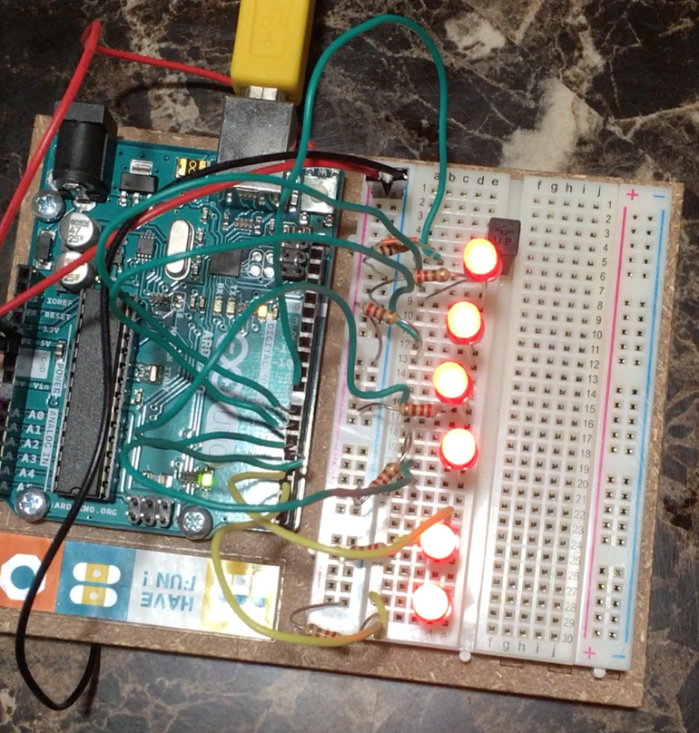
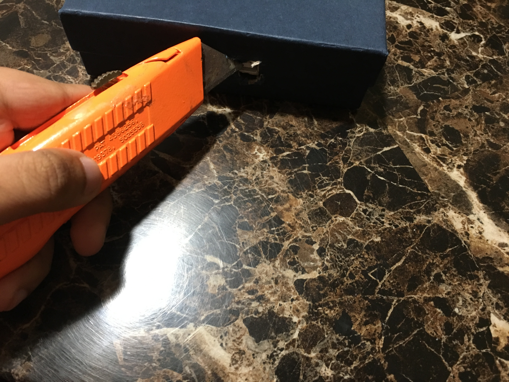
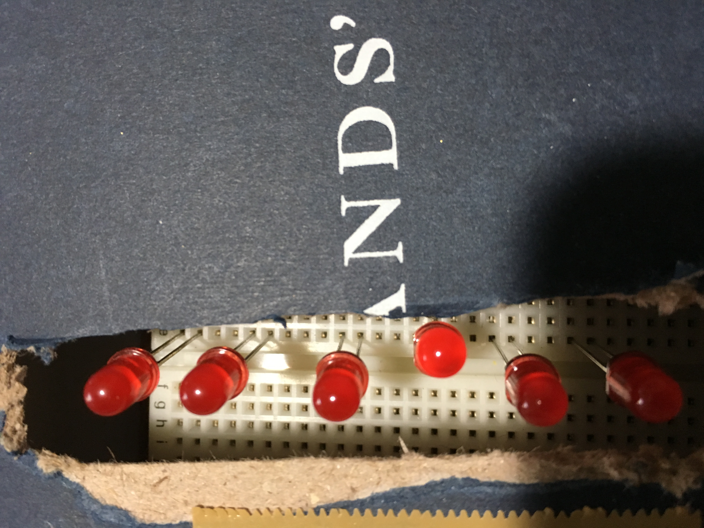
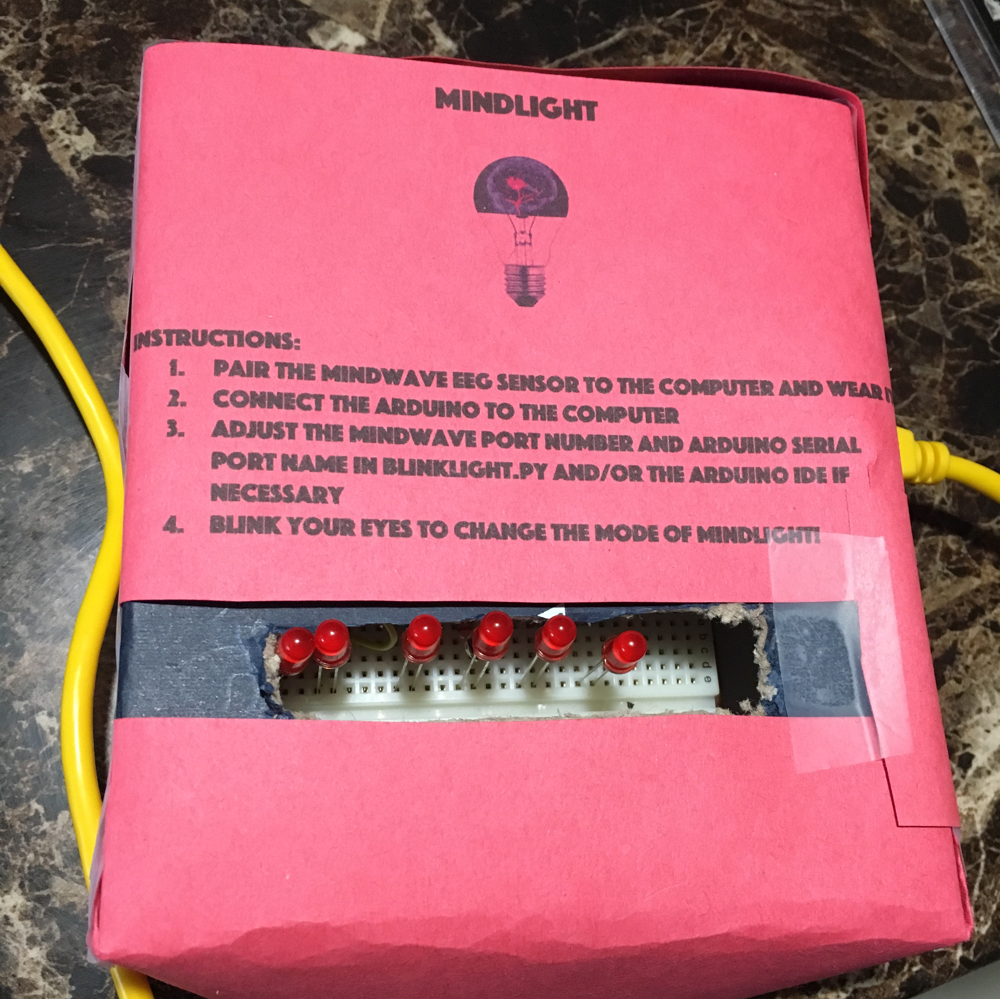

# MindLight

## Why This Project?
I wanted to create a small project that can be controlled without requiring the use of many physical movements. The applications of this project can be extended to numerous domains and can primarily assist people who happen to have physical disabilities. This project utilizes an EEG sensor that can sense when a person blinks in order to control a flashlight that uses 6 red LEDs. It's a "mind controlled flashlight", if you will. The goal of this project was to be able to receive input from the EEG sensor and translate the raw output into a meaningful serial input for the Arduino to use.

## Parts
* NeuroSky MindWave Mobile EEG Headset
* Arduino Uno
* 6 Red LEDs
* 6 220 Ohm Resistors
* 6 Jumper Wires
* Cutting tools

## Input
The input to MindLight is a blink from the user registered by the EEG sensor. The EEG sensor gives back a value with the strength of the blink, and if this strength is not 0, the blink was made intentionally. When an intentional blink is made, a Python program writes a character to the Arduino's serial port. I used a Python program as the "middle man" between the EEG sensor and the Arduino because of the simplicity in receiving raw data from the EEG sensor. Using the Python program reduces overhead in using the socket protocols necessary to receive input from the MindWave Headset.

## Output
The output of MindLight is the different modes of the flashlight. The user input, a blink, toggles between each mode. The modes are:
* All Off
* All On
* All Strobe

MindLight initially starts off with all of the LEDs turned off. When a blink is recorded, all of the LEDs turn on. When another blink is recorded, the LEDs begin to strobe in a preset interval. Finally, when yet another blink is recorded, all of the LEDs return to the All Off state ready to be used again in the future. I decided to use LEDs as a way of representing the EEG sensor readings because they are a simple way to demonstrate various modes or settings of a final product. Being able to control devices, such as a flashlight without requiring major movements, is the first step in being able to control more complex devices that can truly impact one's quality of life.

## Case
MindLight is encased in a box which is cut to display the LEDs and allow a USB cable to connect to the Arduino.

## The Code
### Translating MindWave Readings
MindWave sensor readings can be transmitted and received using either the ThinkGear Socket Protocol, which is a JSON-based protocol to exchange brainwave data between a client and a server, or a standard serial port API. For simplicity, I utilized the latter and used the Telnet protocol which provides a bidirectional text-oriented communication interface. In `blinkLight.py`, I create a Telnet object which listens on the localhost IP address on port 13854 (which is the default port that the MindWave Headset binds to once connected via Bluetooth). I also create a Serial object that's used for Serial communication with the Arduino. I then send a JSON request to the MindWave Headset, requesting raw output data in the JSON format for easy reading and parsing. Because sensor readings are fed in about every second or so, in an infinite loop, I read in the raw output using Telnet. If I receive a JSON object that contains the blink strength, I send a bit to the Arduino's serial port signaling it to change to the next mode of MindLight.

### Lights On!
In `mindlight.ino`, once the toggling bit is received by the Arduino's serial port, the mode of the MindLight is changed to either ALL_OFF, ALL_ON, or ALL_STROBE. The first two modes turn off all 6 LEDS and turn on all 6 LEDs respectively. ALL_STROBE switches the lights from on and off after a preset interval to mimic a strobing effect. These modes resemble that of an actual flashlight!

## The Final Product

Watch the MindLight demo [here](https://youtu.be/P9qsmH5y4IQ)!

## Project Retrospective
### What Worked
Ultimately, the entire end-to-end pipeline of MindWave headset, to a port on my computer, to the Arduino's serial port, and finally instructions to the LEDs worked well overall. A user's blink is able to be successfully translated into changing the modes of a constructed flashlight.

### What Didn't Work
Although the pipeline works, there are a few bottlenecks and hardware limitations that prevent MindLight from working very well. For one, the MindWave Headset does not have 100% accuracy and often has a slight delay between a user's blink and the raw output being sent. Further, the computational time required to receive the input via Bluetooth and send it to the Arduino's serial port is noticeable enough to prevent MindLight from being natural. Some of these limitations could be mitigated by connecting the MindWave Headset directly to the Arduino using a Bluetooth module; however, this was not done in this project for the sake of simplicity. As far as the delay in the EEG sensor readings, that can be mitigated by using a more advanced EEG sensor capable of transmitting signals faster and more efficiently.

### if more_time:
If I had more time, I would try to experiment more with the other sensor readings, such as the different brainwaves and the meditation and attention levels, and see if they could be used as reliable user input. For instance, I would try to utilize a machine learning technique, such as a neural network or support vector machine, to try to predict a user's thought among a discrete instance space using the different EEG sensor readings as input. I would also try directly connecting the headset to the Arduino and compare the time complexity with the current version of the project.
